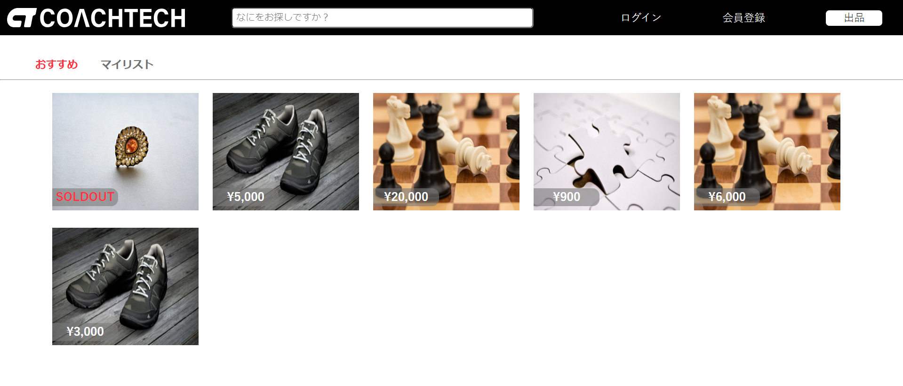
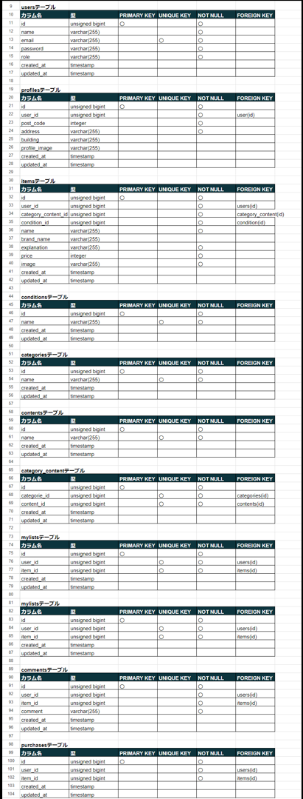
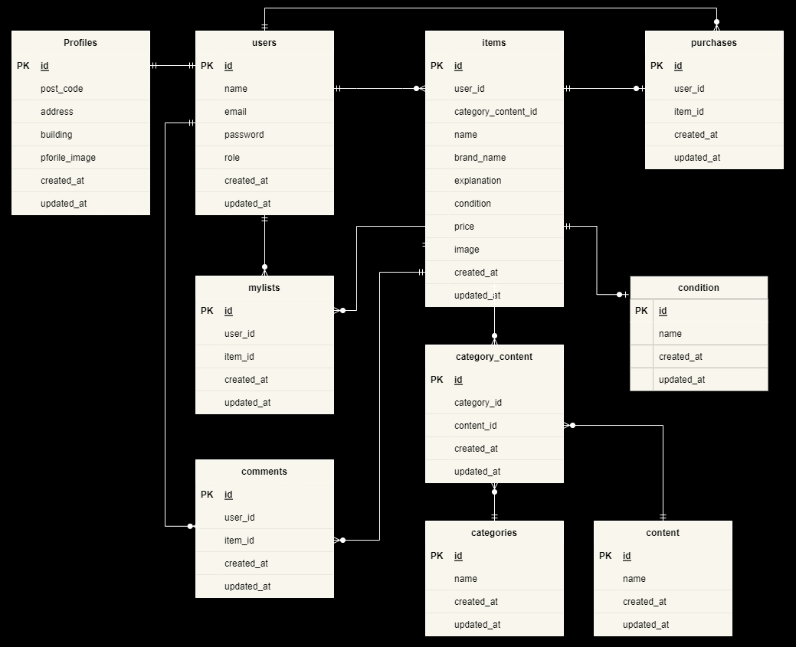

# fleamarket(フリマアプリ)

概要：企業独自のフリマアプリ

## 作成した目的

概要：coachtech ブランドのアイテムを出品する

## アプリケーション URL

WEB アプリ URL：http://35.74.207.200/

## 他のリポジトリ

GitHub（https）：https://github.com/MinaYamamoto/fleamarket.git

AWS 　 S3
・名前：fleamarket-bucket

## 機能一覧

・会員登録機能

・ログイン機能

・ログアウト機能

・商品一覧取得機能

・商品詳細取得機能

・商品お気に入り一覧取得機能

・ユーザ情報取得機能

・ユーザ購入商品一覧取得機能

・ユーザ出品商品一覧取得機能

・プロフィール変更機能

・商品お気に入り追加機能

・商品お気に入り削除機能

・商品コメント追加機能

・商品コメント削除機能

・商品配送先変更機能

・商品購入機能（カード決済、コンビニ決済、銀行決済）

・出品機能

・商品コメント削除機能

**管理者機能**

・一般ユーザコメント削除

・一般ユーザ削除

・メール送信

## 使用技術（実行環境）

・PHP:8.0

・Laravel:8.83.27

・MySQL:8.0.35

・docker-compose:2.24.6

## テーブル設計

## ER 図

## 環境構築

**Docker ビルド**

1.任意のフォルダを作成

2.コマンドより「1.」で作成した任意のフォルダに移動し、fleamarket.git をクローンする  
git clone git@github.com:MinaYamamoto/fleamarket.git

3.「fleamarket」フォルダに移動し、docker をビルドする  
docker-compose up -d --build

---

**Laravel 環境構築**

1.PHP コンテナ内にログイン  
docker-compose exec php bash

2.ログイン後、必要なパッケージをインストール  
composer install

3.「.env.example」ファイルをコピーして「.env」ファイルを作成  
cp .env.example .env

4.「.env」ファイルの環境変数を変更  
DB_HOST=mysql  
DB_DATABASE=laravel_db  
DB_USERNAME=laravel_user  
DB_PASSWORD=laravel_pass  
MAIL_HOST=mailtrip の SMTP Settings タブより設定値をコピー  
MAIL_PORT=mailtrip の SMTP Settings タブより設定値をコピー  
MAIL_USERNAME=mailtrip の SMTP Settings タブより設定値をコピー  
MAIL_PASSWORD=mailtrip の SMTP Settings タブより設定値をコピー  
MAIL_ENCRYPTION=mailtrip の SMTP Settings タブより設定値をコピー  
MAIL_FROM_ADDRESS=mailtrip の SMTP Settings タブより設定値をコピー  
STRIPE_KEY=stripe の公開可能キー  
STRIPE_SECRET=stripe のシークレットキー

5.「.env」ファイルをコピーして「.env.testing」ファイルを作成  
cp .env .env.testing

6.「.env.testing」ファイルの環境変数を変更  
DB_DATABASE=demo_test  
DB_USERNAME=root  
DB_PASSWORD=root

7.「.env」ファイルをコピーして「.env.ci」ファイルを作成  
cp .env .env.ci

8.「.env.ci」ファイルの環境変数を変更  
DB_DATABASE=demo_test  
DB_USERNAME=test  
DB_PASSWORD=password

9.アプリケーション起動のためのキーを生成  
php artisan key:generate

10.マイグレーションを実行  
php artisan migrate

11.データベースへテスト用の初期データを投入  
php artisan db:seed

12.シンボリックリンクを作成  
php artisan storage:link

13.「fleamarket」配下にある以下ファイルを storage>app>public フォルダに格納  
　 ai-generated-8674235_1280.png  
　 checkmate-1511866_1280.jpg  
　 clover-8108105_1280.jpg  
　 jewellery.jpg  
　 logo.svg  
　 profile.svg  
　 puzzle-3223941_1280.jpg  
　 scarf.jpg  
　 shoes.jpg

## その他記述

・テスト用ログインユーザ

_管理者_  
　　 Email：admin@email.com  
　　 Password：12345678

_ユーザ１(主に出品者)_  
　　 Email：user1@email.com  
　　 Password：12345678

_ユーザ２（主に購入者）_  
　　 Email：user2@email.com  
　　 Password：12345678

・開発環境はローカル、本番環境は AWS を使用しています。

・AWS は SSL 認証の設定を行っていません。「http」にてアクセスしてください。

・AWS へのデプロイは以下を使用しています。  
_CicleCi_  
　　プロジェクト名：coachtech

・メールの確認には mailtrap を使用しています。  
　　 URL：https://mailtrap.io/email-sandbox/

・決済には stripe を使用しています。  
　　 URL：https://dashboard.stripe.com/
